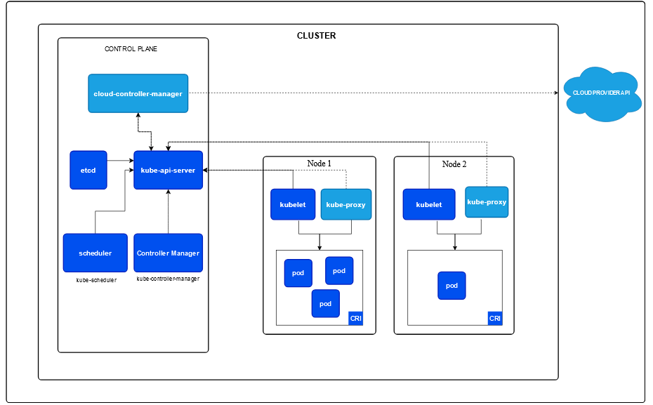

# Kubernetes Zero to Hero Learning Path



# Kubernetes Exam Official Documentation

For preparation and reference during the Kubernetes exams, you can use the official documentation provided by Kubernetes. Ensure you are familiar with navigating and searching through it effectively.

## Official Documentation Links

- [Kubernetes Documentation](https://kubernetes.io/docs/)
- [Certified Kubernetes Administrator (CKA) Exam Guide](https://training.linuxfoundation.org/certification/certified-kubernetes-administrator-cka/)
- [Certified Kubernetes Application Developer (CKAD) Exam Guide](https://training.linuxfoundation.org/certification/certified-kubernetes-application-developer-ckad/)
- [Certified Kubernetes Security Specialist (CKS) Exam Guide](https://training.linuxfoundation.org/certification/certified-kubernetes-security-specialist/)

## Tips for Exam Preparation
1. Familiarize yourself with the documentation structure.
2. Practice finding relevant information quickly using the search bar.
3. Bookmark important sections like:
   - [kubectl Commands](https://kubernetes.io/docs/reference/generated/kubectl/kubectl-commands/)
   - [Pod Configuration](https://kubernetes.io/docs/tasks/configure-pod-container/)
   - [Networking](https://kubernetes.io/docs/concepts/cluster-administration/networking/)
   - [Security](https://kubernetes.io/docs/concepts/security/overview/)

---

## Note
During the exam, you will have access to the official documentation but not the entire internet. Practice using only the official resources to simulate the exam environment.


## Preparation on Your Laptop: Step-by-Step Guide

### 1. Docker Desktop Installation
Follow the [official guide](https://www.docker.com/products/docker-desktop/) to install Docker Desktop on your system.

### 2. WSL Installation on Windows
Set up Windows Subsystem for Linux (WSL) by following the [Microsoft WSL documentation](https://learn.microsoft.com/en-us/windows/wsl/install).

### 3. Kind Installation on Windows and WSL
#### Kind Installation on Linux
Use the following commands based on your system architecture:

```bash
# For AMD64 / x86_64
[ $(uname -m) = x86_64 ] && curl -Lo ./kind https://kind.sigs.k8s.io/dl/v0.26.0/kind-linux-amd64

# For ARM64
[ $(uname -m) = aarch64 ] && curl -Lo ./kind https://kind.sigs.k8s.io/dl/v0.26.0/kind-linux-arm64

# Make it executable
chmod +x ./kind

# Move it to a directory in your PATH
sudo mv ./kind /usr/local/bin/kind
Kind Installation on Windows
```

### 4. Kind Installation on Windows

### For Windows, run the following commands in PowerShell:

```
curl.exe -Lo kind-windows-amd64.exe https://kind.sigs.k8s.io/dl/v0.26.0/kind-windows-amd64
Move-Item .\kind-windows-amd64.exe c:\some-dir-in-your-PATH\kind.exe
```
4. Creating a Cluster and Configuring Nodes
Using PowerShell Command Line

 Create a Kubernetes cluster with Kind:
 ```
  kind create cluster
```
Label worker nodes:
 ```

kubectl label nodes kind-worker node-role.kubernetes.io/worker=
kubectl label nodes kind-worker2 node-role.kubernetes.io/worker=
kubectl get nodes
```


